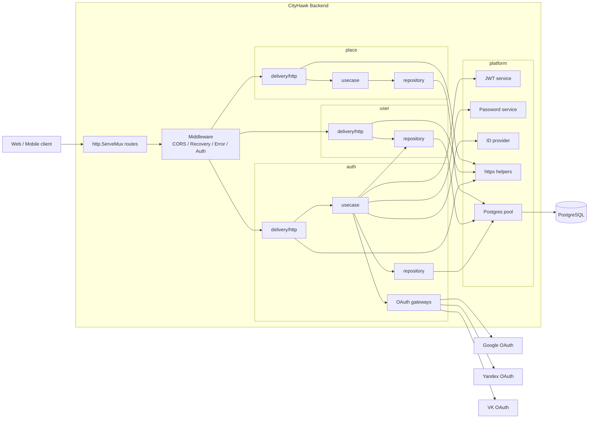
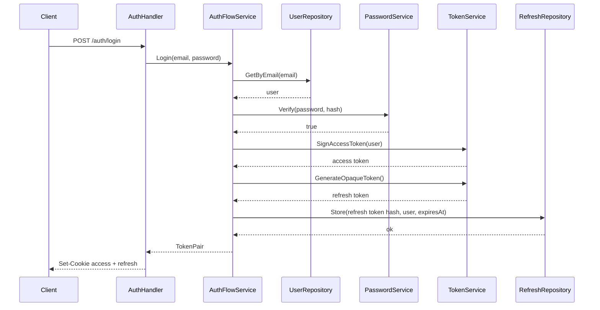
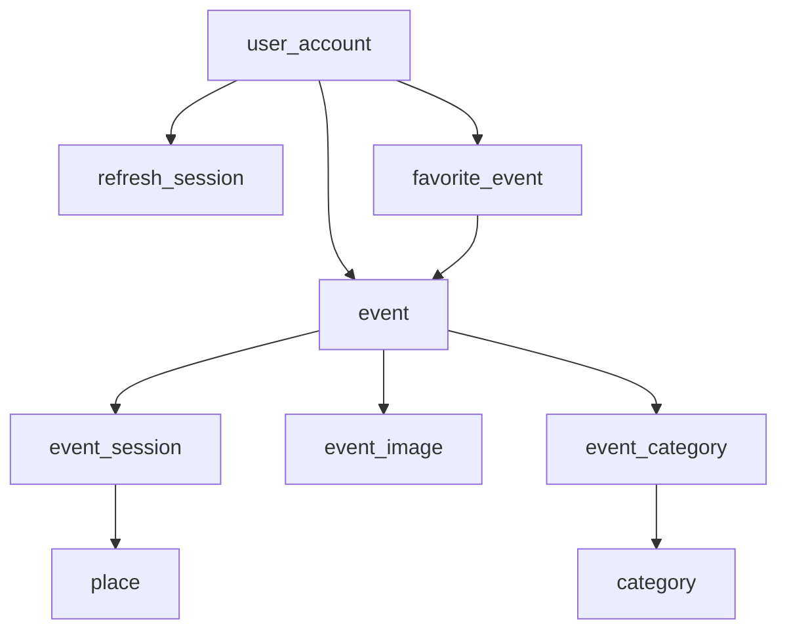

# Архитектура CityHawk Backend

Этот документ нужен как карта проекта: что здесь уже реализовано, как проходят запросы через код и как между собой связаны папки.

## 1. Что это за проект

Сейчас это backend для сервиса CityHawk, который:

- поднимает HTTP API на Go;
- хранит данные в PostgreSQL;
- умеет регистрировать и логинить пользователей;
- поддерживает refresh/access токены через cookie;
- умеет логинить через OAuth (`Google`, `Yandex`, `VK`);
- отдает данные для каталога мест/событий (`/places`, `/api/home`, `/places/best`, `/places/category/...`);
- содержит основу для дальнейшего роста: в схеме БД уже есть коллекции, подписки, приглашения, шаринг и уведомления, хотя не все эти сущности еще выведены в API.

По факту это модульный монолит:

- один сервис;
- одна кодовая база;
- один HTTP-сервер;
- одна база данных;
- внутри код разделен по доменам и слоям.

## 2. Как читать структуру папок

```text
cmd/main.go                  -> точка входа
internal/app                 -> сборка приложения и wiring зависимостей
internal/config              -> конфиг из env
internal/auth                -> аутентификация, токены, OAuth
internal/user                -> пользователь и endpoint /me
internal/place               -> каталог мест/событий для главной и карточек
internal/platform            -> общие технические компоненты
db/migrations                -> реальная схема БД и seed-данные
db/normalized                -> документация по БД
```

Главная мысль: доменные пакеты (`auth`, `user`, `place`) не создают зависимости сами. Все зависимости собираются в одном месте, в `internal/app/server.go`.

## 3. Главная архитектурная идея

Проект устроен по схеме, близкой к `delivery -> usecase -> repository -> infrastructure`:

- `delivery/http` принимает HTTP-запрос, валидирует вход, собирает HTTP-ответ;
- `usecase` содержит бизнес-логику и orchestration;
- `repository` умеет читать и писать данные;
- `model` хранит доменные структуры;
- `platform` дает общие сервисы: JWT, bcrypt, middleware, JSON/error helpers, Postgres pool, генерацию ID.

Это не “чистая” Clean Architecture в академическом виде, но очень похожий практический вариант:

- хендлеры тонкие;
- usecase зависит от интерфейсов;
- репозитории можно подменять;
- в тестах используются `in-memory` реализации.

## 4. Общая диаграмма



## 5. Реальный путь запуска

### 5.1 Точка входа

Запуск начинается в `cmd/main.go`:

1. грузится `.env`, если файл есть;
2. читается конфиг через `internal/config`;
3. вызывается `app.NewServer(cfg)`;
4. сервер стартует через `ListenAndServe`.

### 5.2 Где собираются зависимости

`internal/app/server.go` это composition root проекта. В нем:

- создается `pgxpool`;
- создаются postgres-репозитории;
- создаются сервисы JWT/bcrypt/ID;
- создаются usecase-сервисы;
- создаются HTTP-хендлеры;
- регистрируются маршруты в `http.ServeMux`;
- сверху навешиваются middleware.

Если коротко: почти вся архитектура сходится именно здесь.

## 6. Что делает каждый слой

### 6.1 `delivery/http`

Это внешний HTTP-слой. Его задачи:

- проверить HTTP method;
- распарсить JSON или path/query параметры;
- вызвать нужный usecase;
- перевести результат в JSON/cookie/HTTP status code.

Примеры:

- `internal/auth/delivery/http/register.go`
- `internal/auth/delivery/http/login.go`
- `internal/place/delivery/http/handler.go`
- `internal/user/delivery/http/me.go`

### 6.2 `usecase`

Это центр бизнес-потока.

Здесь код не знает про HTTP-детали, но знает:

- как регистрировать пользователя;
- как логинить;
- как выдавать пару токенов;
- как ротировать refresh token;
- как находить или создавать пользователя из OAuth;
- как собирать выдачу лучших мест.

Примеры:

- `auth/usecase/AuthFlowService` отвечает за register/login;
- `auth/usecase/Service` отвечает за issue/refresh/revoke токенов;
- `auth/usecase/OAuthLoginService` отвечает за OAuth login flow;
- `place/usecase/Service` отвечает за домашнюю выдачу, список, категории, best.

### 6.3 `repository`

Это адаптеры к хранилищу.

Сейчас есть два варианта:

- `postgres` реализации для реального приложения;
- `inmemory` реализации для тестов.

Именно поэтому usecase работает через интерфейсы, а не напрямую через SQL.

### 6.4 `platform`

Это общий технический слой:

- `platform/security` -> JWT и bcrypt;
- `platform/middleware` -> CORS, recovery, auth middleware, error wrapper;
- `platform/httpx` -> JSON writer, HTTP error mapping, OpenAPI helpers;
- `platform/postgres` -> создание pgx pool;
- `platform/id` -> генерация UUID.

Это не бизнес-домен, а reusable инфраструктура.

## 7. Домены проекта

## 7.1 `auth`

Самый насыщенный домен в текущем коде.

Он покрывает:

- регистрацию по email/password;
- логин по email/password;
- refresh/logout;
- OAuth login через Google/Yandex/VK;
- установку `access_token` и `refresh_token` в cookie.

Внутреннее разбиение:

- `delivery/http` -> endpoints `/auth/...`;
- `usecase` -> orchestration login/register/oauth/refresh;
- `repository` -> хранение refresh sessions;
- `gateway` -> работа с внешними OAuth-провайдерами;
- `validation` -> проверка email/password/username;
- `model` -> token pair и OAuth identity.

### Поток обычного логина



### Поток `GET /me`

1. `AuthMiddleware` читает cookie `access_token`.
2. JWT парсится и проверяется.
3. `subject` из claims кладется в context.
4. `MeHandler` достает `userID` из context.
5. `UserRepository.GetByID(...)` возвращает пользователя.
6. Клиент получает JSON профиля.

### Поток OAuth логина

1. `GET /auth/{provider}/login` генерирует `state`, кладет его в cookie и делает redirect.
2. Провайдер возвращает пользователя на callback.
3. callback-хендлер сверяет `state`.
4. `OAuthLoginService` просит gateway получить identity по `code`.
5. `OAuthUserService` ищет или создает локального пользователя.
6. обычный token service выдает access/refresh пару.

Идея хорошая: интеграция с внешними провайдерами изолирована в `gateway`, а остальной auth flow остается одинаковым.

## 7.2 `user`

Сейчас домен минимальный.

Фактически он состоит из:

- модели `User`;
- репозитория пользователя;
- endpoint `GET /me`.

Здесь важно понять: `user` пока не самостоятельный богатый модуль, а базовая сущность, от которой зависят `auth` и часть БД.

## 7.3 `place`

Название домена немного маскирует смысл.

На уровне API модуль уже отдает именно события, хотя историческое имя пакета осталось `place`. Это видно по SQL в `internal/place/repository/postgres.go`:

- база запроса строится от таблицы `event`;
- дальше подтягиваются `event_session`, `place`, `event_image`, `event_category`, `favorite_event`;
- наружу это маппится в `EventDetails`, `EventCard`, `HomeFeaturedEvent`.

То есть:

- в API это называется `event`;
- в БД первичная сущность для выдачи это скорее `event`;
- реальная “локация” лежит в таблице `place`.

Это не ошибка, но важный архитектурный нюанс, который стоит помнить при развитии проекта.

Функции домена:

- `GET /api/events` -> список карточек мероприятий;
- `GET /places/{id}` -> детали;
- `GET /places/category/{category}` -> фильтр;
- `GET /places/best` -> лучшие по лайкам;
- `GET /api/home` -> данные для главной страницы.

При этом `HomePayload` частично собирается из базы, а частично содержит захардкоженные mood-карточки в usecase.

## 8. Middleware и cross-cutting логика

В `internal/platform/middleware/http.go` лежат основные общие механизмы:

- `CorsMiddleware` разрешает фронтенд-ориджины и cookie credentials;
- `RecoveryMiddleware` ловит panic и возвращает `500`;
- `ErrorMiddleware` позволяет хендлерам возвращать `error`, а не вручную писать ответ везде;
- `AuthMiddleware` защищает `GET /me` через access cookie.

Это удобная точка для будущих общих вещей:

- request logging;
- tracing;
- metrics;
- rate limiting.

## 9. Как устроены токены и сессии

### Access token

- это JWT;
- подписывается через HS256;
- содержит `Subject = userID`;
- содержит тип токена `type = access`;
- живет ограниченное время (`ACCESS_TOKEN_TTL`).

### Refresh token

- это не JWT, а случайная opaque-строка;
- в базе хранится только `sha256` хеш;
- при refresh токен “consume”-ится, то есть удаляется и заменяется новым;
- это дает ротацию refresh token и снижает риск повторного использования.

Это хорошее практическое решение: короткоживущий access + server-side refresh sessions.

## 10. Как устроена база данных

Схема БД заметно шире, чем текущий API.

### Уже используются кодом

- `user_account`
- `refresh_session`
- `event`
- `event_session`
- `place`
- `event_image`
- `event_category`
- `category`
- `favorite_event`

### Уже есть в БД, но пока почти не используются текущим backend API

- `collection`
- `collection_image`
- `collection_event`
- `user_follow`
- `event_invitation`
- `event_invitation_event`
- `event_invitation_session`
- `share_link`
- `share_link_event`
- `share_link_collection`
- `notification`
- связанные notification-таблицы

Из этого следует важный вывод: схема данных проектировалась с запасом на социальные и контентные сценарии, а backend пока реализует только первую часть функциональности.

### Упрощенная диаграмма данных, которые реально участвуют в API сейчас



## 11. Почему тесты устроены через in-memory

В `internal/app/*_test.go` бизнес-сценарии тестируются без реальной базы:

- `InMemoryUserRepository`
- `InMemoryRefreshRepository`
- `InMemoryRepository` для place

Это значит, что usecase-слой реально отделен от инфраструктуры.

Плюсы такого подхода:

- тесты быстрые;
- меньше зависимости от внешней среды;
- проще проверять бизнес-логику отдельно.

Минус:

- SQL-запросы и соответствие схемы реальной БД покрываются слабее и требуют отдельных интеграционных тестов.

## 12. Сильные стороны текущей архитектуры

- Понятное разделение по доменам.
- Есть единая точка сборки зависимостей.
- Usecase зависит от интерфейсов, а не от конкретной БД.
- Есть подмена репозиториев на in-memory в тестах.
- OAuth вынесен в gateway-адаптеры.
- Refresh token хранится безопаснее, чем в виде голого значения.
- Схема БД уже подготовлена под рост продукта.

## 13. Что может путать в текущем проекте

- Домен `place` по имени выглядит как “места”, но фактически выдает карточки `event`.
- HTTP cookies сейчас используются и для access, и для refresh; если кто-то ожидает `Authorization: Bearer`, этого здесь нет.
- В `server.go` сервер всегда поднимается с Postgres pool, даже если часть логики в тестах умеет работать in-memory.
- В БД есть много сущностей, которых пока нет в API, поэтому визуально проект может казаться больше, чем реально реализованный backend.

## 14. Как проще всего мысленно представить проект

Если совсем по-простому, то проект можно держать в голове так:

- `cmd/main.go` -> запусти приложение;
- `internal/app/server.go` -> собери всё вместе;
- `internal/auth` -> кто пользователь и как он логинится;
- `internal/user` -> как получить текущего пользователя;
- `internal/place` -> что показать на главной и в каталоге;
- `internal/platform` -> все общие технические детали;
- `db/migrations` -> что реально хранится в PostgreSQL.

## 15. Короткий итог в одном абзаце

CityHawk Backend сейчас это Go-монолит с модульной структурой, где HTTP-слой отделен от бизнес-логики и доступа к данным. Основная реализованная функциональность сосредоточена вокруг аутентификации и каталога событий, который в API называется `places`. Все собирается в `internal/app/server.go`, хранение идет через PostgreSQL, а общая инфраструктура вынесена в `internal/platform`. Схема БД уже рассчитана на более крупный продукт, чем тот набор endpoint-ов, который реализован прямо сейчас.
